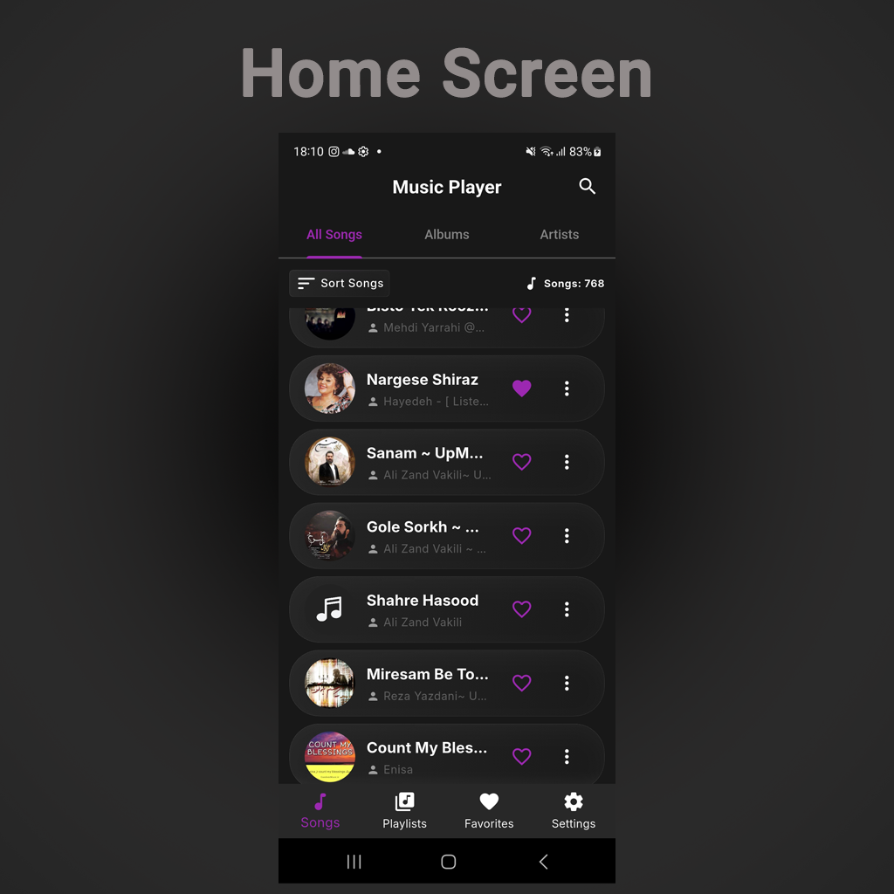
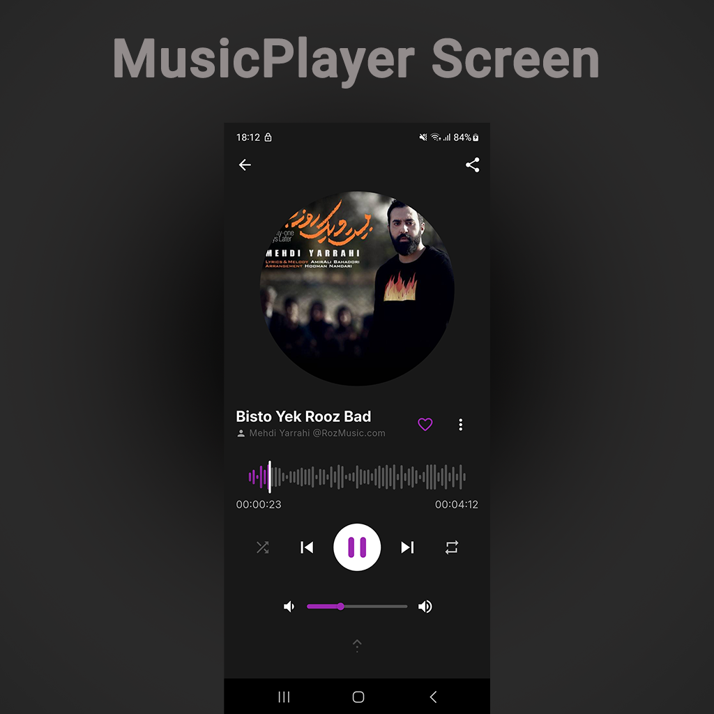
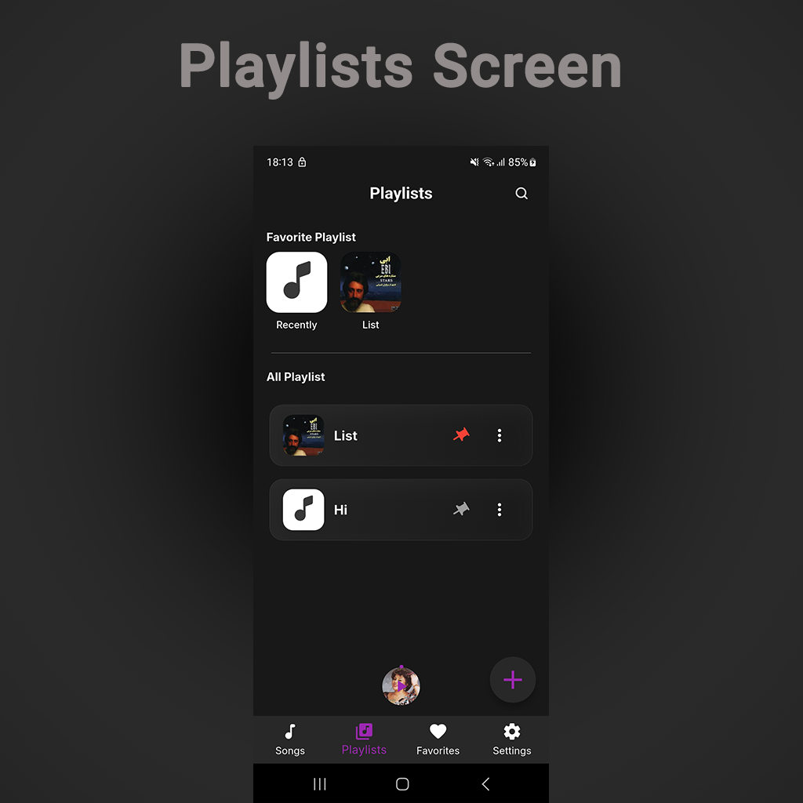
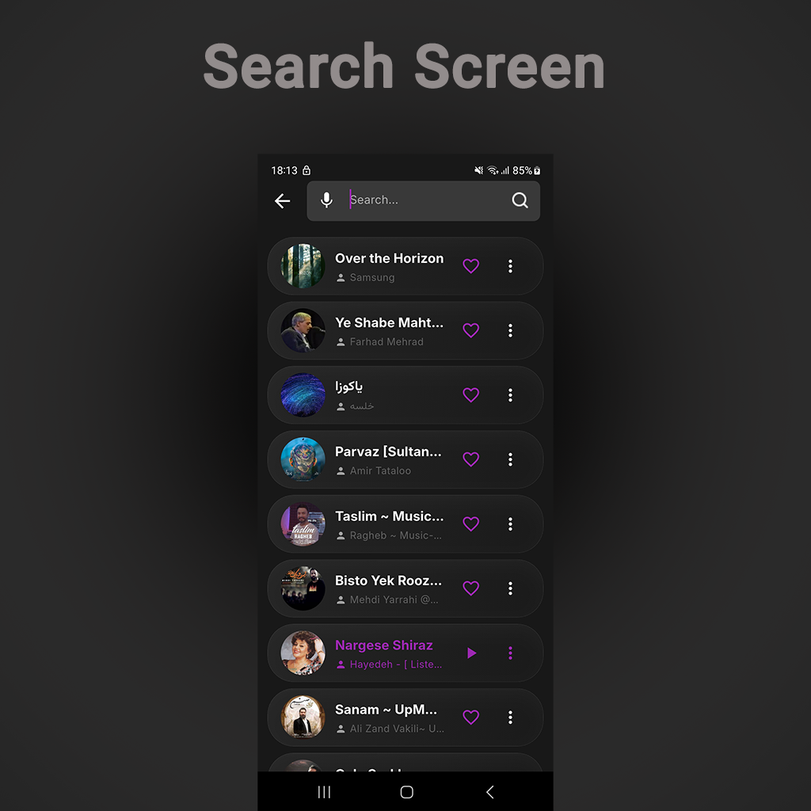
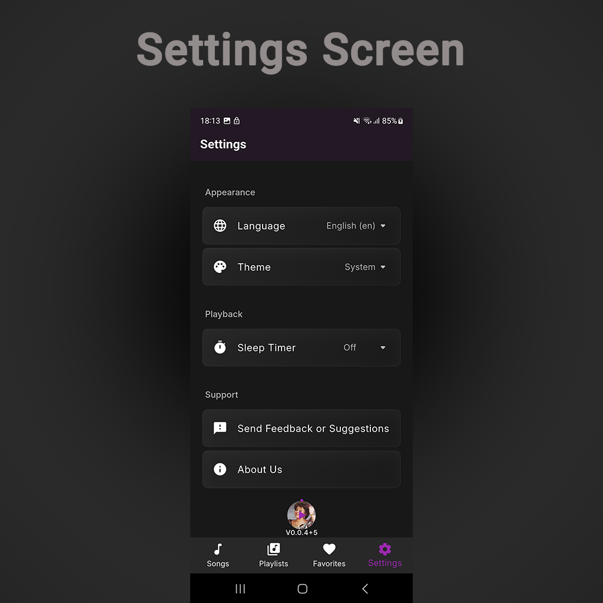

# 🎵 Music Player

A feature-rich, offline music player built with Flutter that provides a seamless music listening experience with support for playlists, favorites, search, and more.


## ✨ Features

- 🎵 Play local music files from device storage
- 📱 Beautiful and intuitive user interface
- 🔍 Advanced search functionality with voice search support
- ❤️ Favorite songs management
- 📝 Custom playlist creation and management
- 🎨 Clean architecture with BLoC state management
- 🌐 Multi-language support (English & Persian)
- 🎨 Custom theming with dark mode support
- 🔊 Background audio playback
- 📊 Audio visualization
- ⏱️ Sleep timer functionality
- 🔄 Repeat and shuffle modes
- 📤 Share songs with others

## 🛠️ Technologies Used

### Core Framework
- **Flutter** (SDK 3.8.1+) - Cross-platform mobile development framework
- **Dart** - Programming language

### State Management & Architecture
- **flutter_bloc** (^9.1.1) - BLoC pattern implementation for state management
- **bloc** (^9.0.1) - Core BLoC library
- **equatable** (^2.0.7) - Value equality for Dart objects
- **get_it** (^8.2.0) - Service locator for dependency injection

### Audio & Media
- **just_audio** (^0.10.5) - Audio playback
- **audio_service** (^0.18.18) - Background audio service
- **audio_session** (^0.2.2) - Audio session management
- **on_audio_query_pluse** (^3.0.5) - Query audio files from device
- **wave_player** (^0.0.4) - Audio wave visualization
- **volume_controller** (^3.4.0) - System volume control

### UI Components
- **font_awesome_flutter** (^10.9.1) - Icon library
- **auto_size_text** (^3.0.0) - Automatically sized text widgets
- **marquee** (^2.3.0) - Scrolling text animation
- **scrollable_positioned_list** (^0.3.8) - Advanced list scrolling
- **see_more_text** (^1.1.1) - Expandable text widget
- **duration_picker** (^1.2.0) - Time duration picker

### Utilities
- **speech_to_text** (^7.3.0) - Voice search functionality
- **permission_handler** (^12.0.1) - Runtime permissions
- **shared_preferences** (^2.5.3) - Local data persistence
- **path_provider** (^2.1.5) - File system paths
- **package_info_plus** (^9.0.0) - App package information
- **url_launcher** (^6.3.2) - Launch URLs
- **share_plus** (^12.0.0) - Share functionality
- **flutter_dotenv** (^6.0.0) - Environment variables

### Localization
- **flutter_localizations** - Flutter localization support
- **intl** (^0.20.2) - Internationalization and localization

### Monitoring & Analytics
- **sentry_flutter** (^9.8.0) - Error tracking and monitoring

### Development Tools
- **very_good_analysis** (^9.0.0) - Lint rules
- **build_runner** (^2.5.4) - Code generation
- **flutter_launcher_icons** (^0.14.4) - App icon generation
- **flutter_native_splash** (^2.4.6) - Native splash screen

## 📁 Project Structure

```
lib/
├── core/                          # Core functionality and shared resources
│   ├── commands/                  # Command pattern implementations
│   ├── constants/                 # App-wide constants
│   ├── data/                      # Core data layer
│   │   ├── mappers/              # Data mappers
│   │   └── models/               # Data models
│   ├── domain/                    # Core domain layer
│   │   ├── entities/             # Domain entities
│   │   └── usecases/             # Core use cases
│   ├── errors/                    # Error handling
│   ├── mixins/                    # Reusable mixins
│   ├── services/                  # Core services
│   │   ├── audio_handler/        # Audio service handler
│   │   ├── logger/               # Logging service
│   │   └── ringtone_set/         # Ringtone management
│   ├── theme/                     # App theming
│   ├── utils/                     # Utility functions
│   ├── views/                     # Core views
│   └── widgets/                   # Reusable widgets
├── extensions/                    # Dart extensions
├── features/                      # Feature modules
│   ├── favorite/                  # Favorites feature
│   │   ├── data/                 # Favorites data layer
│   │   ├── domain/               # Favorites domain layer
│   │   └── presentation/         # Favorites UI
│   ├── home/                      # Home screen
│   │   └── presentation/         # Home UI
│   ├── music_plyer/              # Music player feature
│   │   ├── data/                 # Player data layer
│   │   ├── domain/               # Player domain layer
│   │   └── presentation/         # Player UI
│   ├── playlist/                  # Playlist management
│   │   ├── data/                 # Playlist data layer
│   │   ├── domain/               # Playlist domain layer
│   │   └── presentation/         # Playlist UI
│   ├── search/                    # Search functionality
│   │   └── presentation/         # Search UI
│   ├── settings/                  # App settings
│   │   └── presentation/         # Settings UI
│   └── songs/                     # Songs library
│       ├── data/                 # Songs data layer
│       ├── domain/               # Songs domain layer
│       └── presentation/         # Songs UI
├── injection/                     # Dependency injection setup
├── localization/                  # Localization files
├── navigation/                    # App navigation
├── app.dart                       # App widget
└── main.dart                      # App entry point

assets/
├── fonts/                         # Custom fonts
│   ├── inter/                    # Inter font family
│   └── vazirmatn/                # Vazirmatn font (Persian)
├── icons/                         # App icons
├── images/                        # Image assets
└── logo/                          # App logo and branding
```

## 🏗️ Architecture

This project follows **Clean Architecture** principles with **BLoC** pattern for state management:

- **Presentation Layer**: UI components and BLoC state management
- **Domain Layer**: Business logic, entities, and use cases
- **Data Layer**: Data sources, repositories, and models

### Key Architectural Patterns:
- **BLoC (Business Logic Component)**: Separates business logic from UI
- **Repository Pattern**: Abstracts data sources
- **Dependency Injection**: Using GetIt for loose coupling
- **Command Pattern**: For executing complex operations

## 🚀 Getting Started

### Prerequisites

- Flutter SDK 3.8.1 or higher
- Dart SDK 3.8.1 or higher
- Android Studio / Xcode (for mobile development)
- A physical device or emulator

### Installation

1. **Clone the repository**
   ```bash
   git clone https://github.com/TalebRafiepour/music_player.git
   cd music_player
   ```

2. **Install dependencies**
   ```bash
   flutter pub get
   ```

3. **Set up environment variables**
   
   Create a `.env` file in the root directory:
   ```bash
   SENTRY_DSN=your_sentry_dsn_here
   ```

4. **Generate launcher icons** (optional)
   ```bash
   flutter pub run flutter_launcher_icons
   ```

5. **Generate native splash screens** (optional)
   ```bash
   flutter pub run flutter_native_splash:create
   ```

### Running the App

#### On Android/iOS Device or Emulator

```bash
flutter run
```

#### Build for Production

**Android APK:**
```bash
flutter build apk --release
```

**Android App Bundle:**
```bash
flutter build appbundle --release
```

**iOS:**
```bash
flutter build ios --release
```

### Permissions

The app requires the following permissions:

- **Storage**: To read audio files from device
- **Microphone**: For voice search functionality (optional)

These permissions are requested at runtime when needed.

## 📸 Screenshots

### Home Screen


### Music Player


### Playlists


### Search


### Settings


## 🧪 Testing

Run tests with:

```bash
flutter test
```

## 📝 Code Quality

This project uses `very_good_analysis` for maintaining code quality. Run analysis with:

```bash
flutter analyze
```

## 🤝 Contributing

Contributions are welcome! Please feel free to submit a Pull Request.

1. Fork the project
2. Create your feature branch (`git checkout -b feature/AmazingFeature`)
3. Commit your changes (`git commit -m 'Add some AmazingFeature'`)
4. Push to the branch (`git push origin feature/AmazingFeature`)
5. Open a Pull Request

## 📄 License

This project is licensed under the MIT License - see the LICENSE file for details.

## 👨‍💻 Author

**Taleb Rafiepour**
- GitHub: [@TalebRafiepour](https://github.com/TalebRafiepour)

## 🙏 Acknowledgments

- Flutter team for the amazing framework
- All open-source contributors whose packages made this project possible

## 📞 Support

For support, please open an issue in the GitHub repository.

---

Made with ❤️ using Flutter
