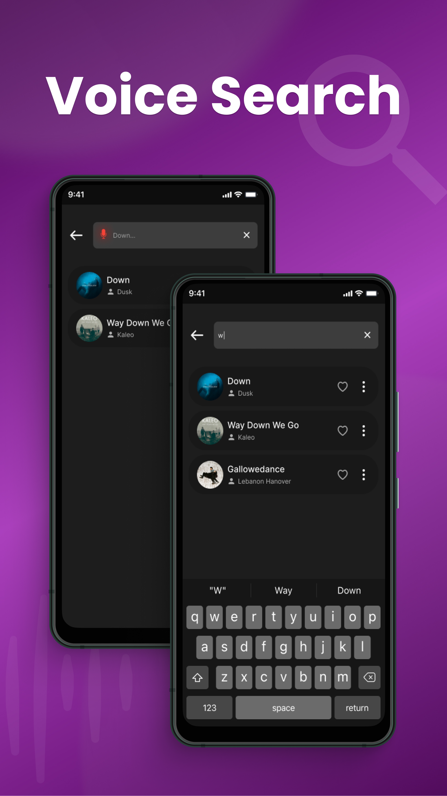
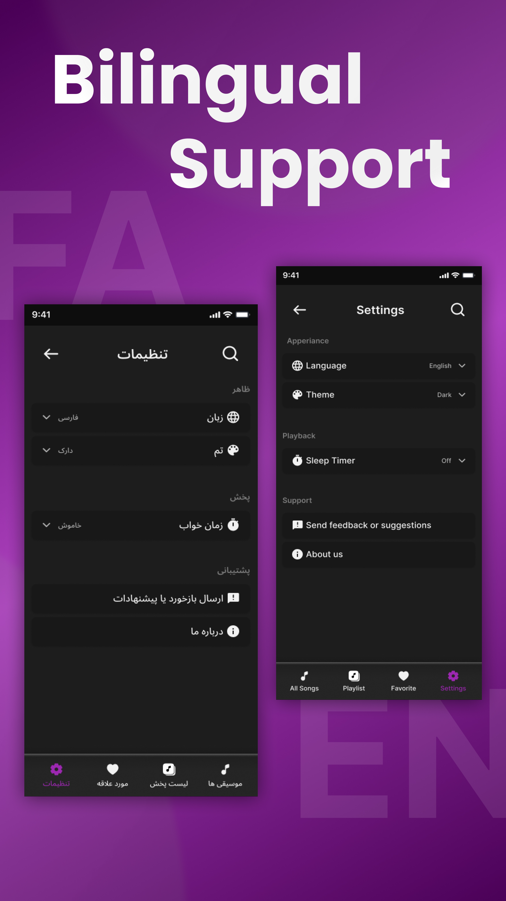
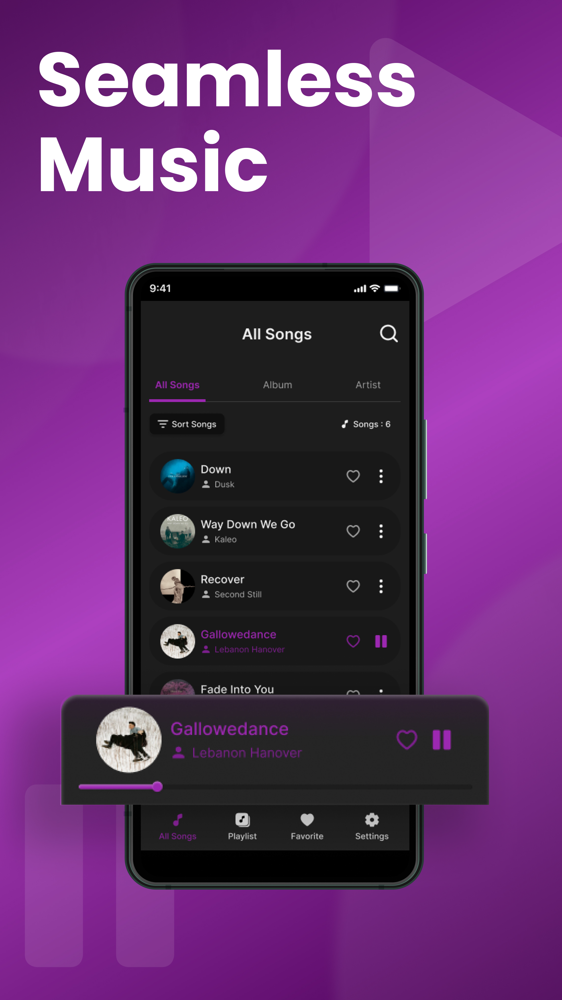
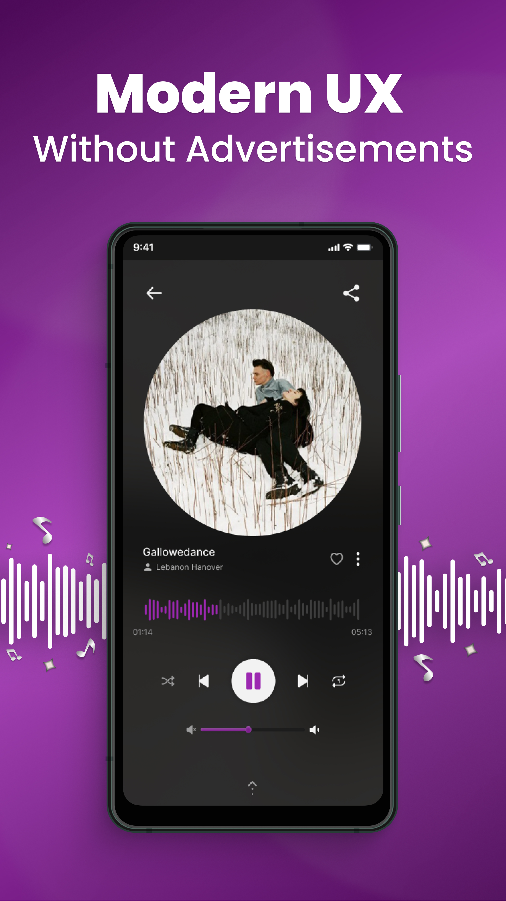
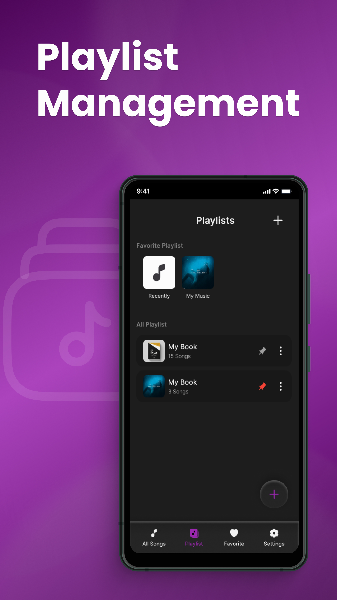
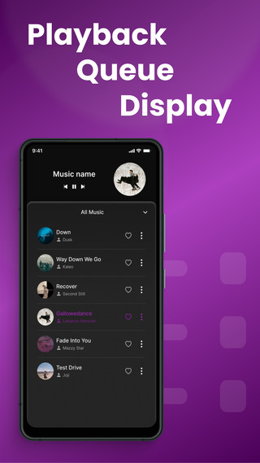
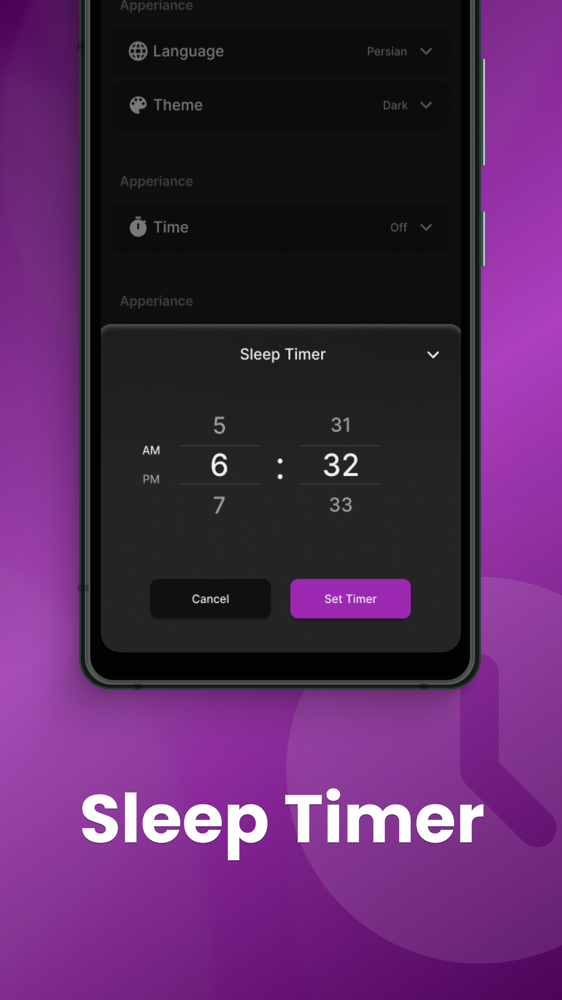
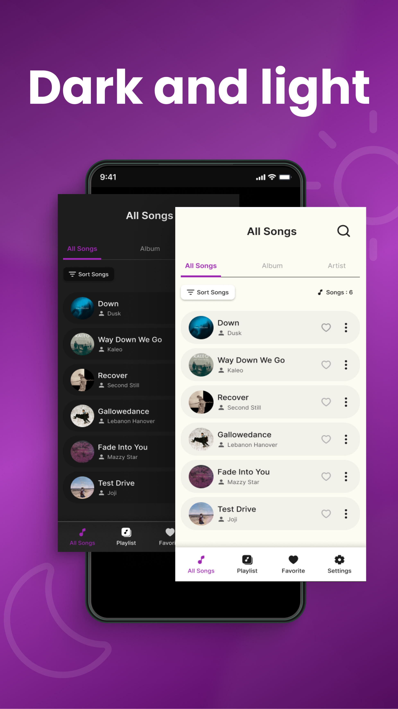

# 🎵 Music Player

A beautifully crafted, offline music player built with **Flutter** that delivers a seamless listening experience. Enjoy your music with playlists, favorites, voice search, and more—all without internet.


---

## ✨ Features

- 🎵 **Local Playback** - Play music files directly from your device
- 📱 **Intuitive UI** - Beautiful, user-friendly interface
- 🔍 **Voice Search** - Find songs using voice commands
- ❤️ **Favorites** - Save and organize your favorite tracks
- 📝 **Playlists** - Create and manage custom playlists
- 🌐 **Multi-Language** - English & Persian support
- 🎨 **Dark Mode** - Easy on the eyes with custom theming
- 🔊 **Background Playback** - Keep listening while using other apps
- 📊 **Audio Visualization** - Watch dynamic waveform animations
- ⏱️ **Sleep Timer** - Auto-stop after a set time
- 🔄 **Repeat & Shuffle** - Control playback modes
- 📤 **Share** - Share your favorite songs instantly

---

## 📸 Screenshots

| | | |
|---|---|---|
|  |  |  |
|  |  |  |
|  |  | |


---

## 🛠️ Technologies Used

### Framework & Language
- **Flutter** (3.8.1+) - Cross-platform mobile development
- **Dart** - Programming language

### State Management & DI
- **flutter_bloc** - BLoC pattern for state management
- **get_it** - Service locator and dependency injection
- **equatable** - Value equality for objects

### Audio Engine
- **just_audio** - Audio playback engine
- **audio_service** - Background audio handling
- **audio_session** - Session management
- **on_audio_query_pluse** - Device audio file queries
- **wave_player** - Waveform visualization
- **volume_controller** - Volume control

### UI & UX
- **font_awesome_flutter** - Icon library
- **auto_size_text** - Responsive text scaling
- **marquee** - Text animations
- **scrollable_positioned_list** - Advanced scrolling
- **duration_picker** - Time selection widget

### Utilities
- **speech_to_text** - Voice search
- **permission_handler** - Runtime permissions
- **shared_preferences** - Local storage

---

## 📁 Project Structure

```
lib/
├── core/                          # Shared logic and resources
│   ├── commands/                  # Command pattern
│   ├── constants/                 # Global constants
│   ├── data/                      # Core data layer
│   ├── domain/                    # Business logic
│   ├── errors/                    # Error handling
│   ├── services/                  # Core services
│   ├── theme/                     # Theming
│   ├── utils/                     # Helpers
│   └── widgets/                   # Reusable widgets
├── features/                      # Feature modules
│   ├── favorite/                  # Favorites management
│   ├── home/                      # Home screen
│   ├── music_player/              # Player screen
│   ├── playlist/                  # Playlist management
│   ├── search/                    # Search functionality
│   ├── settings/                  # App settings
│   └── songs/                     # Music library
├── injection/                     # Dependency setup
├── localization/                  # Translations
└── main.dart                      # Entry point
```

---

## 🏗️ Architecture

This project implements **Clean Architecture** with **BLoC** pattern:

| Layer | Purpose |
|-------|---------|
| **Presentation** | UI & BLoC state management |
| **Domain** | Business logic & use cases |
| **Data** | Repositories & data sources |

**Key Patterns:** BLoC, Repository, Dependency Injection, Command Pattern

---

## 🚀 Getting Started

### Requirements
- Flutter 3.32.8+
- Dart 3.8.1+
- Android Studio / Xcode
- Physical device or emulator

### Setup

1. **Clone the repository**
   ```bash
   git clone https://github.com/Novan-ORG/music_player.git
   cd music_player
   ```

2. **Install dependencies**
   ```bash
   flutter pub get
   ```

3. **Configure environment**
   ```bash
   # Create an empty .env file
   touch .env
   ```

4. **Run the app**
   ```bash
   flutter run
   ```

### Build for Production

```bash
# Android APK
flutter build apk --release

# Android App Bundle
flutter build appbundle --release

# iOS (Coming Soon)
# flutter build ios --release
```

> **Note:** Currently optimized for **Android**. iOS support coming soon.


### Permissions
- **Storage** - Read audio files
- **Microphone** - Voice search (optional)

---

## 📥 Downloads
| Platform | Download |
|----------|----------|
| **GitHub Releases** | [](https://github.com/Novan-ORG/music_player/releases/latest) |
| **CafeBazar** | [](https://cafebazaar.ir/app/com.taleb.music_player) |
| **Myket** | [](https://myket.ir/app/com.taleb.music_player) |

**APK Architectures** (from GitHub Releases):
| Architecture | Download |
|--------------|----------|
| **ARM64 (arm64-v8a)** | [](https://github.com/Novan-ORG/music_player/releases/latest) |
| **ARMv7 (armeabi-v7a)** | [](https://github.com/Novan-ORG/music_player/releases/latest) |
| **x86** | [](https://github.com/Novan-ORG/music_player/releases/latest) |
| **x86_64** | [](https://github.com/Novan-ORG/music_player/releases/latest) |
| **Universal** | [](https://github.com/Novan-ORG/music_player/releases/latest) |

> All APKs are available in the [Releases](https://github.com/Novan-ORG/music_player/releases) page.

---

## 📊 Code Quality

```bash
# Run analysis
flutter analyze

# Run tests
flutter test
```

---

## 🤝 Contributing

We welcome contributions! Follow these steps:

1. Fork the repository
2. Create a feature branch: `git checkout -b feature/YourFeature`
3. Commit changes: `git commit -m 'Add YourFeature'`
4. Push to branch: `git push origin feature/YourFeature`
5. Open a Pull Request

For detailed contribution guidelines, see [CONTRIBUTING.md](CONTRIBUTING.md).

---

## 📄 License

Licensed under the **MIT License** - see [LICENSE](LICENSE) for details.

---

## 👨‍💻 Author & Contributors

**Taleb Rafiepour** - [GitHub](https://github.com/TalebRafiepour)

**Contributors:**
- [@elhamebrahimpour](https://github.com/elhamebrahimpour)
- [@carozamani](https://github.com/carozamani) - UI/UX Design

---

## 🙏 Acknowledgments

- Flutter team for the excellent framework
- All open-source package maintainers

---

## 📞 Support

Found an issue? [Open a GitHub issue](https://github.com/Novan-ORG/music_player/issues)

---
Made with ❤️ by **NOVAN** team using Flutter
